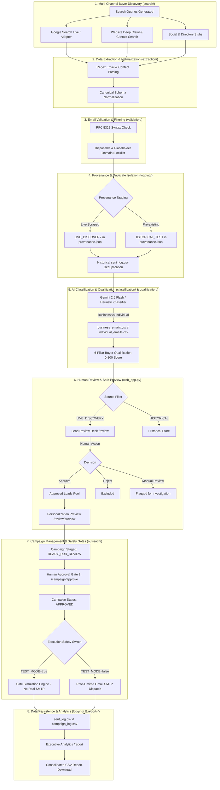

# System Architecture & Technical Specification
## API 3 — EXPORT Automation System

The **API 3 – Export Automation System** is an enterprise-grade, modular Python application built for international B2B buyer discovery, contact data extraction, syntax and disposable email validation, data provenance tracking, AI-assisted classification and qualification, human approval gates, safe simulated/live campaign outreach, and analytical reporting.

---

## 1. End-to-End Pipeline Architecture

---

## 2. Core Architectural Subsystems

### 2.1 Discovery Engine (`search/`)
- **`SearchQueryBuilder`**: Generates targeted B2B trade queries combining product terms (`Singing Bowls`, `Pashmina`), geographic targeting, and commercial procurement footprints (`"wholesale"`, `"importer"`, `"distributor"`).
- **`GoogleSearchAdapter`**: Performs live search extraction with built-in rate-limit delays, user-agent rotation, domain caching, and query diagnostics.
- **`WebsiteSearchAdapter`**: Crawls company websites to discover `/contact`, `/about`, `/wholesale`, and `/inquiry` pages, extracting validated contact info.
- **`RelevanceFilter`**: Performs domain scoring and keyword relevance auditing before records enter the pipeline.

### 2.2 Extraction & Canonical Normalization (`extraction/`)
- **`DataExtractor`**: Employs RFC-compliant regex patterns and HTML `mailto:` attribute extraction to discover raw email candidates.
- **Canonical Schema**: Normalizes all records into a strict 6-column representation:
  `buyer_name`, `company_name`, `email`, `website`, `country`, `source_platform`.
- **Sanitation**: Trims trailing punctuation (`.`, `,`, `:)`, cleans URL parameters, and normalizes email strings to lowercase.

### 2.3 Email Validation & Hygiene (`validation/`)
- **`EmailValidator`**: Validates syntax against strict RFC standards, rejects invalid top-level domains, strips internal whitespace, and checks against a blocklist of disposable email domains (`mailinator.com`, `tempmail.com`, `10minutemail.com`) and dummy placeholder addresses (`test@example.com`, `user@test.com`).

### 2.4 Data Integrity & Provenance Tracking (`logging/`)
- **`discovery_provenance.json`**: Implements immutable source tracking tagging each record as `LIVE_DISCOVERY` (discovered during live runs) or `HISTORICAL_TEST` (pre-seeded testing data).
- **Country Integrity**: Enforces strict factual accuracy without speculative guessing. Leads discovered without explicit geographic evidence are marked `"Unknown — Verification Required"`.
- **Deduplication Engine**: Enforces idempotency against `data/sent_log.csv` so no recipient is ever contacted twice across runs.

### 2.5 AI Classification & Qualification (`classification/` & `qualification/`)
- **Gemini Classification**: Evaluates organizational structure to classify contacts into `business` (B2B wholesale/retail procurement) vs `individual` (personal/retail consumer inboxes), falling back to high-precision deterministic heuristics if the API key is not present.
- **6-Pillar Buyer Qualification Scoring (0–100)**:
  1. **Business Legitimacy (20 pts)**: Domain quality, commercial prefixes, corporate suffixes.
  2. **Product Relevance (20 pts)**: Token and synonym overlap against target export keyword.
  3. **Buyer / Commercial Intent (25 pts)**: Importer, distributor, wholesaler, procurement signals.
  4. **Contact Quality (15 pts)**: Name presence, domain alignment, dedicated business inbox.
  5. **Website Evidence (10 pts)**: Active website, SSL security, catalog availability.
  6. **Country / Data Completeness (10 pts)**: Complete country attribution and verified source.
- **Recommendations**: `REVIEW_FOR_OUTREACH` (Score $\ge 75$), `MANUAL_REVIEW` (50–74), `DO_NOT_CONTACT` ($< 50$).

### 2.6 Human Lead Review & Dual-Gate Safety (`web_app.py`)
- **Lead Review Desk (`/review`)**: Displays `LIVE_DISCOVERY` leads requiring human decision with full qualification audit cards.
- **Review Decisions**: Human reviewers can `Approve`, `Reject`, or flag for `Manual Review`.
- **Personalization Preview (`/review/preview`)**: Renders personalized templates for approved leads with company-specific tokens, checking for missing placeholders before staging.
- **Dual Approval Gate**:
  - *Gate 1*: Explicit lead approval on `/review`.
  - *Gate 2*: Explicit campaign approval on `/campaigns/<id>` before execution.

### 2.7 Outreach Engine & Dual Quota Architecture (`outreach/`)
- **`TEST_MODE` Safety Switch**: When `TEST_MODE=true` (the default), the engine simulates sending with complete timing and rate-limiting fidelity, recording simulation tokens in `sent_log.csv` with zero live network calls.
- **Dual Quota Architecture**:
  - **`DAILY_SEND_LIMIT`**: Applies strictly to real SMTP sends when `TEST_MODE=false` (default: 10/day).
  - **`TEST_SIMULATION_LIMIT`**: Applies to test simulations (default: 50/batch), allowing extensive integration testing without exhausting real sending quotas.
- **`AttachmentHandler`**: Verifies PDF presence, size ($\le 10\text{ MB}$), MIME type, and attaches it cleanly to MIME multipart messages.

### 2.8 Analytical Reporting & Storage (`reports/`)
- **`ReportGenerator`**: Produces formatted console summaries, conversion metrics, audience breakdowns, and streams consolidated CSV exports on `/download-report`.

---

## 3. Data Store Architecture

All persistent datastores reside in the `data/` directory:

| Store File | Format | Description |
| :--- | :--- | :--- |
| `data/buyers.csv` | CSV | Normalized master dataset of discovered and imported buyer contacts. |
| `data/business_emails.csv` | CSV | Qualified B2B / wholesale procurement email addresses. |
| `data/individual_emails.csv` | CSV | Individual / personal consumer email addresses. |
| `data/sent_log.csv` | CSV | Historical outreach log tracking send status, timestamps, and send types (`REAL` vs `TEST_SIMULATION`). |
| `data/campaign_log.csv` | CSV | Log of executed campaigns with recipient counts, success rates, and run dates. |
| `data/campaigns.json` | JSON | Campaign definitions, recipient lists, approval states, and execution histories. |
| `data/classification_log.csv` | CSV | Audit log of AI classification results with confidence scores and reasoning. |
| `data/qualification_log.csv` | CSV | Lead qualification evaluations with 6-pillar point breakdowns and recommendations. |
| `data/lead_review_log.csv` | CSV | Audit trail of human review actions, decisions, and reviewer timestamps. |
| `data/discovery_provenance.json` | JSON | Record-level metadata tracking data origins (`LIVE_DISCOVERY` vs `HISTORICAL_TEST`). |
